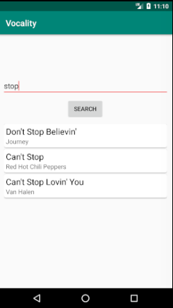

# Vocality

A mobile application for Android devices. The application uses Android Studio, a MySQL database, Amazon Web Services' S3, Java, and PHP.

The application is an Instagram-like application centered around vocals. User's can create accounts, login, add friends, browse their friend's recordings, create recordings of their own and much more! This image shows the search screen for backing tracks to browse to make covers with.

After the user chooses their song, they will be taken to a recording screen where the backing track will play as their voice is recorded using their device's microphone.

